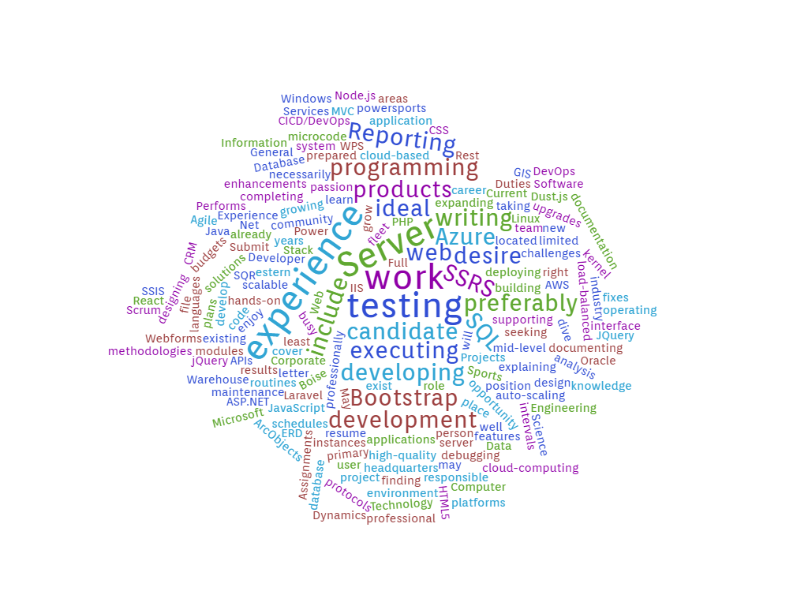

Companies:

> ArmgaSys

[website link](https://www.armgasys.com/)

Tech: C#, ASP.NET, JavaScript, CSS, HTML

Reason: One of their employees came and spoke at my highschool Web Development class, and their internship program seemed really interesting.

> Clearwater

[website link](https://clearwater-analytics.com/)

Tech: Investment technology

Reason: I went to their DevCon in 2019 and was really interesed in some of the panels there, the best was the machine learning investment bot.

> AVIBE

[website link](https://www.avibeweb.com/)

Tech: JavaScript, CSS, HTML

Reason: They are a smaller company based in Oregon and that is the environment I think I would like to work in.

> TitleOne

[website link](https://www.titleonecorp.com/)

Tech: HTML, CSS, JS, C#, SQL

Reason: Company in Boise looking for full stack developers.

> Xylem

[website link](https://www.xylem.com/en-us/)

Tech: Node.js, C#, Git, RESTful APIs

Reason: They are a local company looking for Software Engineers with a focus on sustainability.

> Agree Technologies and Solutions

[website link](http://www.agreetechsol.com/)

Tech: C#, JSON, Node, REST web services

Reason: Boise company looking for Web Engineers.

> Resource Data Inc.

[website link](https://www.resourcedata.com/)

Tech: C#, SQL, HTML, Bootstrap, MVC

Reason: A Boise company looking for Programming analysts that uses tech thats very close to what we are learning.

> Western Power Sports

[website link](https://www.wps-inc.com/)

Tech: Fullstack

Reason: A Boise company looking for Fullstack web developers.

> HP

[website link](https://www8.hp.com/us/en/home.html)

Tech: RESTful Databases

Reason: They have a campus in Boise looking for Web Engineers.

> Micron

[website link](https://www.micron.com/)

Reason: They are a close company, but one that might be hard to earn a job at.

Top Words: Experience, Server, Testing, Work, Web

